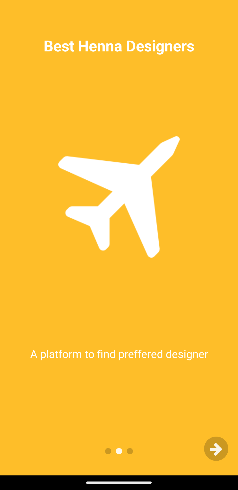
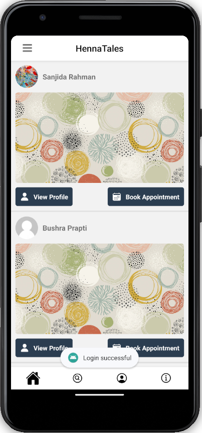

<div align="center">
  <h1>Henna Tale</h1>
</div>

<br>

**This is the frontend of the following backend:** [https://github.com/JenishaSanjida/henna-server.git](https://github.com/JenishaSanjida/henna-server.git)

## Table of Contents
* [Description](#description)
  - [Designer's Flow](#designer-flow)
  - [Customer's Flow](#customer-flow)
* [Used Technologies](#used-technologies)
* [Used Awesome Things](#used-awesome-things)
* [Install and Run](#install-and-run)
* [Important commands](#important-commands)
* [Git commands](#git-commands)


### Description

#### Walkthrough Screens

Before reaching the login or registration page, users are guided through a series of walkthrough screens that introduce them to the app's journey and features.

<div style="display: flex; flex-wrap: wrap; justify-content: space-around;">
    <figure>
        
        <figcaption style="width: 200px;">Walkthrough Screen 1</figcaption>
    </figure>
    <figure>
        
        <figcaption style="width: 200px;">Walkthrough Screen 2</figcaption>
    </figure>
    <figure>
        
        <figcaption style="width: 200px;">Walkthrough Screen 3</figcaption>
    </figure>
</div>

#### Designer Flow

**Designer App** is a platform where henna designers can showcase their designs, set their availability, and connect with customers.

<div style="display: flex; flex-wrap: wrap; justify-content: space-around;">
    <figure>
        
        <figcaption style="width: 200px;">Users can register as a designer by providing their division, district, and thana, enabling customers to search for them based on these criteria.</figcaption>
    </figure>
    <figure>
        
        <figcaption style="width: 200px;">Designers can log in to access their profiles and manage their designs and appointments.</figcaption>
    </figure>
    <figure>
        
        <figcaption style="width: 200px;">Home page with user list. Designers cannot book other designers as well as customers. That's why "Book Appointment" buttons are disabled here.</figcaption>
    </figure>
</div>


<div style="display: flex; flex-wrap: wrap; justify-content: space-around;">
    <figure>
        
        <figcaption style="width: 200px;">Designers can browse through other designers' profiles, view their designs, and explore their portfolios.</figcaption>
    </figure>
    <figure>
        
        <figcaption style="width: 200px;">Designers can search for other designers based on their address, including division, district, and thana.</figcaption>
    </figure>
    <figure>
        
        <figcaption style="width: 200px;">Designers can set their availability by specifying time slots based on their convenient timings.</figcaption>
    </figure>
</div>

<div style="display: flex; flex-wrap: wrap; justify-content: space-around;">
    <figure>
        
        <figcaption style="width: 200px;">Selecting Day</figcaption>
    </figure>
    <figure>
        
        <figcaption style="width: 200px;">Selecting Time</figcaption>
    </figure>
    <figure>
        
        <figcaption style="width: 200px;">Deleting Time Slot</figcaption>
    </figure>
</div>

<div style="display: flex; flex-wrap: wrap; justify-content: space-around;">
    <figure>
        
        <figcaption style="width: 200px;">Designers can upload their henna designs to showcase their portfolio and capabilities.</figcaption>
    </figure>
    <figure>
        
        <figcaption style="width: 200px;">Leftbar Menu</figcaption>
    </figure>
    <figure>
        
        <figcaption style="width: 200px;">Designers can view their bookings with customers from the left sidebar, allowing them to manage their appointments effectively.</figcaption>
    </figure>
</div>

<br>

#### Customer Flow

**Customer App** is a platform where customers can search for nearby henna designers, view their profiles, and book appointments for henna services.

<div style="display: flex; flex-wrap: wrap; justify-content: space-around;">
    <figure>
        
        <figcaption style="width: 200px;">Customers can register and login to access the app's features and functionalities.</figcaption>
    </figure>
    <figure>
        
        <figcaption style="width: 200px;">Customers can see all the designers here and book appointment</figcaption>
    </figure>
    <figure>
        
        <figcaption style="width: 200px;">Customers can search for designers by divisions, district, and thana to find nearby designers.</figcaption>
    </figure>
</div>

<div style="display: flex; flex-wrap: wrap; justify-content: space-around;">
    <figure>
        
        <figcaption style="width: 200px;">Customers can view a designer's profile and explore their portfolio to choose a designer according to their design preferences.</figcaption>
    </figure>
    <figure>
        
        <figcaption style="width: 200px;">Customers can book an appointment with a designer of their choice, selecting a date and viewing available time slots for that date.</figcaption>
    </figure>
    <figure>
        
        <figcaption style="width: 200px;">Selected Time Slot</figcaption>
    </figure>
</div>

<div style="display: flex; flex-wrap: wrap; justify-content: space-around;">
    <figure>
        
        <figcaption style="width: 200px;">Customers can provide their contact details while booking an appointment. The designer will contact the customer to provide home service at the specified time and location.</figcaption>
    </figure>
    <figure>
        
        <figcaption style="width: 200px;">Leftbar for customers</figcaption>
    </figure>
    <figure>
        
        <figcaption style="width: 200px;">Customers can view their bookings with designers, keeping track of their upcoming appointments.</figcaption>
    </figure>
</div>

<div style="display: flex; flex-wrap: wrap; justify-content: space-around;">
    <figure>
        
        <figcaption style="width: 200px;">App about page</figcaption>
    </figure>
</div>

<br>

### Used Technologies

- [**nodejs `v18.13.0`**][nodejs]
- **npm `v8.19.3`**
- **react**
- [**react native `v0.71.1`**](https://reactnative.dev/)

### Used Awesome Things

- [React native app intro slider](https://www.npmjs.com/package/react-native-app-intro-slider)
- [React native vector icons](https://www.npmjs.com/package/react-native-vector-icons)


### Install and Run

```sh
git clone https://github.com/JenishaSanjida/henna-tale.git
cd henna-tale
npm install
# Run this command in one terminal
npx react-native start
# Run this command in another terminal
npx react-native run-android
# Make sure you've opened at least one emulator or device connected
```

### Important commands

```sh
# to see the connected device list
adb devices
```

### Git Commands

```sh
# Copy the repository into your local pc
git clone <repository_url>

# see project status whether you have any changes or not
git status

# see local branches
git branch

# see local and remote branches
git branch -a

# switch to a new branch
git checkout -b <branch_name>

# switch to an existing branch
git checkout <branch_name>

# stage all your changes
git add .

# commit your changes
git commit -m "your commit message"

# after pushing to your branch, switch to development branch and merge your branch with development branch
git checkout development
git merge jenisha
git push origin development

# pull from remote branch
git pull origin development
```

### Emulator things

- Open android-studio.

### Debug run

```sh
npx react-native bundle --platform android --dev false --entry-file index.js --bundle-output android/app/src/main/assets/index.android.bundle --assets-dest android/app/src/main/res/

npx react-native run-android
```

<!-- Definitions -->
[nodejs]: https://nodejs.org/en/
[reactjs]: https://reactjs.org/
[reactnative]: https://reactnative.dev/
